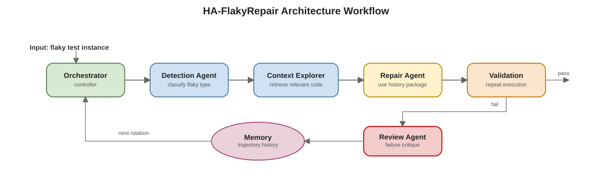

# Architecture: History-Aware Agentic Flaky Repair (HA-FlakyRepair)

## 1. System Overview

History-Aware Agentic Flaky Repair (HA-FlakyRepair) is an architecture for automatically repairing flaky tests. The main idea is simple: instead of trying to fix a flaky test in one attempt, the system works in iterations and remembers what happened in previous attempts.

This is important because flaky tests are often hard to fix from a single failure message. A first repair attempt may be wrong, incomplete, or based on an incorrect assumption. For this reason, HA-FlakyRepair stores the history of the repair process and uses that history in the next iteration.

The architecture is built around three main parts:

- a **controller** that manages the process,
- a set of **specialized agents** that perform specific tasks,
- a **memory layer** that stores the repair history.

At the center of the architecture there is a **Trajectory Memory**, which stores the sequence of repair iterations. This allows the system to:

- retain failed hypotheses instead of discarding them,
- avoid repeating ineffective repair strategies,
- refine its reasoning based on past observations, and
- converge toward a valid patch under a bounded repair budget.

The architecture is designed for flaky tests caused by issues such as execution order, timing, shared state, asynchronous behavior, or concurrency. Since these failures are non-deterministic, the system must validate candidate fixes more than once and must learn from failed attempts.

At the system level, HA-FlakyRepair has **four specialized agents** and **one controller**:

- **Detection Agent**
- **Context Explorer**
- **Repair Agent**
- **Review Agent**
- **Orchestrator** as the controller coordinating the loop

So, if the Orchestrator is counted as part of the agentic system, the architecture has **5 active components**. If only specialized agents are counted, it has **4 agents**. The **Memory Layer** is not an agent; it is shared state used across rotations.

### Architecture Workflow

The workflow of the architecture is:

1. The **Orchestrator** starts a repair session for one flaky test.
2. The **Detection Agent** identifies or confirms the flaky type.
3. The **Context Explorer** retrieves only the relevant test and production code.
4. The **Repair Agent** proposes a patch using current evidence plus history.
5. The system runs **validation**.
6. If validation fails, the **Review Agent** produces a critique.
7. The critique and observations are stored in **Trajectory Memory**, and the next rotation begins.

Editable source: `diagrams/ha-flakyrepair-overview.drawio`

At a high level, the workflow has four phases:

- **Initialization**: start the repair session.
- **Analysis**: identify the flaky type and retrieve the relevant code.
- **Repair and validation**: propose a patch and test it.
- **Learning loop**: store the result and use it in the next iteration.

## 2. Core Architectural Components

### A. The Orchestrator (Controller)

The **Orchestrator** is the central controller of the architecture. It manages the repair session from beginning to end.

Its role is to coordinate the other components, keep track of the current iteration, and decide when the process should stop.

Its main responsibilities are:

- initialize the repair session for a target flaky test,
- maintain the current **rotation count** `t`,
- enforce a maximum repair budget `T_max`,
- collect outputs from all agents at each iteration,
- assemble the **History Package** used to condition the next repair attempt,
- trigger validation and decide whether the session should continue or terminate.

The Orchestrator stops when:

- the candidate patch passes validation,
- the maximum number of iterations `T_max` is reached,
- or the process is no longer making useful progress.

### B. Specialized Agent Layer

HA-FlakyRepair uses a small set of specialized agents. Each agent has one clear role. This makes the architecture modular and easier to control.

#### 1. Detection Agent

The **Detection Agent** analyzes the test failure and identifies the flaky type.

Its purpose is to answer questions such as:

- Is this test really flaky?
- What kind of flakiness is it?
- Is it related to order, timing, shared state, or concurrency?

This information is important because the repair strategy depends on the type of flakiness.

#### 2. Context Explorer

The **Context Explorer** selects only the code that is relevant to the failure.

Instead of sending the whole repository to the repair process, it focuses on:

- the flaky test,
- related helper methods,
- relevant production code,
- setup and teardown logic,
- and any code connected to shared state or timing behavior.

This keeps the repair step focused.

#### 3. Repair Agent (Programmer)

The **Repair Agent** proposes a patch for the flaky test.

It uses:

- the current failure information,
- the flaky category,
- the focused code context,
- and the history of previous attempts.

Its main output is a candidate patch. The important point is that it does not work only from the latest failure; it also uses the repair history.

#### 4. Review Agent (Critic)

The **Review Agent** analyzes failed repair attempts.

It does not directly create the next patch. Instead, it explains why the last attempt failed and what should change in the next iteration.

This review step is one of the main differences between HA-FlakyRepair and a simple repair pipeline.

### C. Memory Layer (Vault)

The **Memory Layer** stores the information produced during the repair session. It is the part that makes the architecture history-aware.

The most important memory is the **Trajectory Memory**, which stores the sequence of iterations:

`H_t = {(thought_i, action_i, observation_i, critique_i)} for i = 1 ... t`

In simple terms, for each iteration the memory stores:

- the reasoning behind the attempted fix,
- the patch that was applied,
- the validation result,
- and the critique produced after failure.

This means that every failed attempt is still useful, because it becomes part of the knowledge used in the next iteration.

## 3. Iterative Repair Loop

HA-FlakyRepair works as an iterative loop:

1. The Orchestrator starts a repair session for a target test.
2. The Detection Agent classifies the flaky behavior.
3. The Context Explorer retrieves the relevant code context.
4. The Repair Agent proposes a patch.
5. The patch is validated.
6. If validation succeeds, the process stops.
7. If validation fails, the Review Agent explains the failure.
8. The result is stored in memory.
9. The process repeats until success or until `T_max` is reached.

This turns repair into a learning loop instead of a sequence of disconnected retries.

## 4. History Package

Before each new iteration, the Orchestrator builds a **History Package**. This is a compact summary of what happened before.

It is important to distinguish the **History Package** from the **Trajectory Memory**:

- **Trajectory Memory** is the full record of the repair session across all iterations.
- **History Package** is a short summary created from that memory before the next iteration.

In other words, the Trajectory Memory is the complete history, while the History Package is the filtered version that is passed to the Repair Agent for the next step.

It can include:

- a summary of all previous repair hypotheses,
- the patches that were attempted,
- the observed validation results,
- failure modes still unresolved,
- the Review Agent's critiques,
- explicit "do not repeat" guidance for ineffective strategies,
- promising directions inferred from partial progress.

This is what makes the architecture history-aware. The Repair Agent does not see only the latest failure; it also sees a short summary of the previous iterations.

## 5. Validation Strategy

Since flaky tests are non-deterministic, one execution is not enough. The architecture therefore uses repeated validation, for example:

- repeated test execution,
- randomized order re-execution,
- environment perturbation when relevant,
- consistency checks across multiple seeds or schedules.

The validation result can be:

- **Pass**: the patch consistently suppresses the flaky behavior,
- **Partial improvement**: failure frequency drops but does not disappear,
- **No improvement**: failure persists unchanged,
- **Regression**: the patch introduces new failures or destabilizes other behavior.

These outcomes are then used by the Review Agent and stored in memory.

## 6. Why This Architecture Matters

The main contribution of HA-FlakyRepair is architectural: it treats flaky repair as a process with memory, not as a one-shot task.

This matters because:

- flaky failures are ambiguous and often require multiple hypotheses before the correct one is found,
- prior failed repairs contain useful negative evidence,
- explicit memory and critique reduce repeated mistakes and wasted repair budget.

Compared with a simple repair pipeline, HA-FlakyRepair offers:

- stronger reasoning continuity across iterations,
- better use of failure history,
- improved robustness against repeated bad patch patterns,
- more targeted context selection,
- a clearer mechanism for bounded convergence.

## 7. Summary

HA-FlakyRepair is a multi-agent architecture for flaky test repair. The Orchestrator controls the process, four specialized agents perform the main tasks, and the Memory Layer stores the repair history. The key architectural idea is that each failed attempt is not discarded; it is stored, reviewed, and reused in the next iteration. This makes the system more suitable for flaky tests, where repair often requires several guided attempts rather than one single patch.
