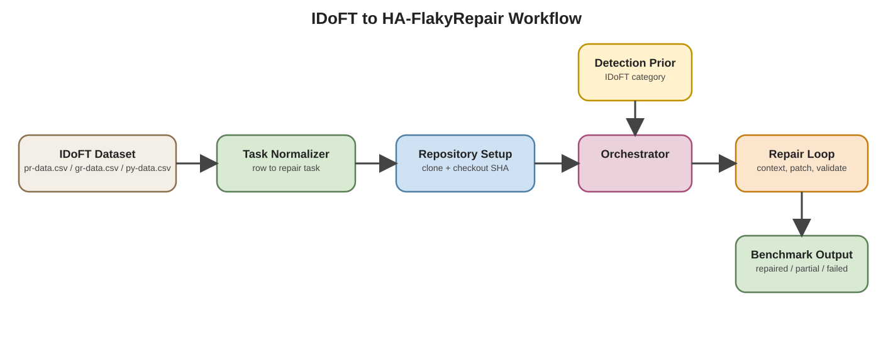
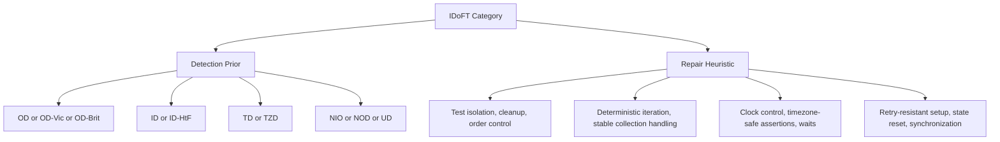
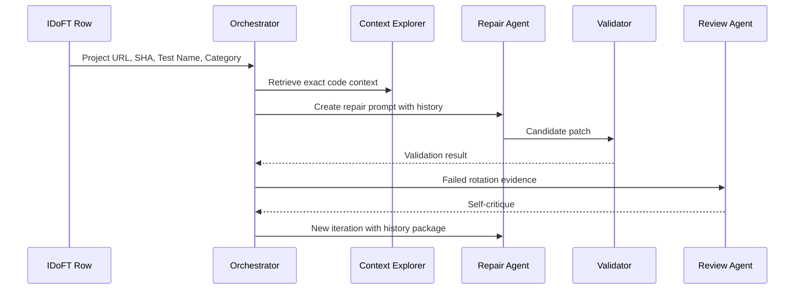

# IDoFT Dataset Notes for HA-FlakyRepair

This document separates the dataset and benchmark material from the main architecture document.

## 1. Using the IDoFT Dataset with HA-FlakyRepair

The **International Dataset of Flaky Tests (IDoFT)** is a practical input source for HA-FlakyRepair because it already provides flaky-test instances, commit SHAs, module paths, test identifiers, and flaky categories. The repository contains three main dataset files:

- `pr-data.csv` for Java projects using Maven,
- `gr-data.csv` for Java projects using Gradle,
- `py-data.csv` for Python projects.

These files can be used to seed repair sessions, evaluate repair success across flaky categories, and compare performance across ecosystems.

## 2. Where IDoFT fits in the architecture



Editable source: `diagrams/ha-flakyrepair-idoft.drawio`

This mapping is straightforward:

- an IDoFT row initializes the target flaky test,
- the `Category` column informs the Detection Agent and Repair Agent,
- the SHA and module/test identifiers help the Context Explorer recover the exact failing revision,
- the validation loop checks whether a synthesized patch removes the flakiness,
- the result is appended to trajectory memory for the next rotation.

## 3. Dataset structure relevant to HA-FlakyRepair

For HA-FlakyRepair, the most important fields from IDoFT are:

| Field | Why it matters in HA-FlakyRepair |
| --- | --- |
| `Project URL` | lets the Orchestrator clone or index the target repository |
| `SHA Detected` | pins the exact revision where flakiness was observed |
| `Module Path` | narrows build and test scope for Java projects |
| `Fully-Qualified Test Name` or `Pytest Test Name` | identifies the flaky test instance to reproduce |
| `Category` | conditions diagnosis and patch strategy |
| `Status` | helps filter out skipped, irreproducible, or deprecated cases |
| `Notes` | may contain reproduction hints, seeds, logs, or issue links |

## 4. Common flaky categories from IDoFT

The IDoFT README documents categories such as:

- `OD` for order-dependent tests,
- `ID` for implementation-dependent tests,
- `NIO` for non-idempotent-outcome tests,
- `NOD`, `NDOD`, and `NDOI` for non-deterministic variants,
- `OSD`, `TD`, and `TZD` for operating-system, time, and time-zone dependent tests,
- `UD` when the precise dependency is unknown.

Those categories align well with HA-FlakyRepair because they can be used as priors for repair planning.



## 5. How to download IDoFT

The simplest way is to clone the repository:

```bash
git clone https://github.com/TestingResearchIllinois/idoft.git
cd idoft
```

If you only need the CSV files, you can download them directly from GitHub:

- `https://raw.githubusercontent.com/TestingResearchIllinois/idoft/main/pr-data.csv`
- `https://raw.githubusercontent.com/TestingResearchIllinois/idoft/main/gr-data.csv`
- `https://raw.githubusercontent.com/TestingResearchIllinois/idoft/main/py-data.csv`

If you want the full metadata, keep the whole repository because it also includes helper directories such as:

- `repo-info`,
- `verify_test_type`,
- `format_checker`,
- `odr-tests.csv`,
- `tic-fic-data.csv`,
- `tso-iso-rates.csv`.

## 6. How to use IDoFT in an HA-FlakyRepair pipeline

A typical workflow is:

1. Select one dataset file based on ecosystem:
   `pr-data.csv` for Maven, `gr-data.csv` for Gradle, `py-data.csv` for Python.
2. Filter rows by supported category and status.
3. Clone the target repository from `Project URL`.
4. Checkout `SHA Detected`.
5. Reproduce the flaky test using the test identifier and module path.
6. Feed the row metadata into the Orchestrator as the initial repair state.
7. Run the HA-FlakyRepair iterative loop until success or `T_max`.
8. Record the final result as repaired, partially improved, irreproducible, or failed.

Example: extract Maven rows labeled `OD` from `pr-data.csv` with Python:

```python
import csv

with open("pr-data.csv", newline="") as f:
    reader = csv.DictReader(f)
    od_rows = [row for row in reader if "OD" in row.get("Category", "")]

for row in od_rows[:5]:
    print({
        "project": row.get("Project URL"),
        "sha": row.get("SHA Detected"),
        "module": row.get("Module Path"),
        "test": row.get("Fully-Qualified Test Name"),
        "category": row.get("Category"),
    })
```

The output of that preprocessing step can be passed directly into the Orchestrator as seed tasks.



## 7. Minimal practical usage example

For Java, the README provides an example flaky test entry:

| Field | Example value |
| --- | --- |
| Project URL | `https://github.com/alibaba/fastjson` |
| SHA Detected | `e05e9c5e4be580691cc55a59f3256595393203a1` |
| Module Path | `.` |
| Test Name | `com.alibaba.json.bvt.date.DateTest_tz.test_codec` |
| Category | `OD` |

This can be translated into an HA-FlakyRepair session as:

```text
Target repository: https://github.com/alibaba/fastjson
Target revision: e05e9c5e4be580691cc55a59f3256595393203a1
Target test: com.alibaba.json.bvt.date.DateTest_tz.test_codec
Flaky class: OD
Initial hypothesis: the test depends on suite order, shared state, or environmental residue
```

Expected repair focus:

- inspect test setup and teardown,
- inspect shared mutable state,
- inspect static caches or global configuration,
- rerun with reordered tests to verify order dependence.

For Python, the README gives this example:

| Field | Example value |
| --- | --- |
| Project URL | `https://github.com/AguaClara/aguaclara` |
| SHA Detected | `9ee3d1d007bc984b73b19520d48954b6d81feecc` |
| Pytest Test Name | `tests/core/test_cache.py::test_ac_cache` |
| Category | `NIO` |

In HA-FlakyRepair, that test would naturally trigger a repair strategy centered on:

- test idempotence,
- cache invalidation,
- repeated execution under the same environment,
- state reset between runs.

## 8. Example preprocessing step

Before launching repair, HA-FlakyRepair can convert each CSV row into a normalized task object:

```json
{
  "dataset": "IDoFT",
  "language": "java",
  "build_system": "maven",
  "project_url": "https://github.com/alibaba/fastjson",
  "sha_detected": "e05e9c5e4be580691cc55a59f3256595393203a1",
  "module_path": ".",
  "test_name": "com.alibaba.json.bvt.date.DateTest_tz.test_codec",
  "category": ["OD"],
  "status": null,
  "notes_url": null
}
```

The Orchestrator can then use this object to:

- create a working directory,
- checkout the pinned revision,
- dispatch the Detection Agent with the known flaky prior,
- retrieve focused context around the test and touched production code,
- start the iterative repair loop.

## 9. Recommended filtering rules

Not every IDoFT row is equally suitable for automated repair experiments. A practical subset for HA-FlakyRepair should:

- exclude rows with statuses such as `Skipped`, `RepoDeleted`, `RepoArchived`, or `Irreproducible`,
- prioritize rows with a single clear category before handling multi-label cases,
- start with Java Maven or Python cases if your toolchain support is stronger there,
- prefer rows with notes or reproduction metadata when available,
- separate benchmark sets by category so OD, ID, and time-related tests are not mixed blindly.

## 10. Why IDoFT is a good benchmark for HA-FlakyRepair

IDoFT is useful for this architecture because it provides:

- real flaky tests from open-source projects,
- exact revision pinning through `SHA Detected`,
- category labels that can guide agent behavior,
- examples across Java and Python,
- a natural benchmark for evaluating iterative repair instead of single-shot patching.
